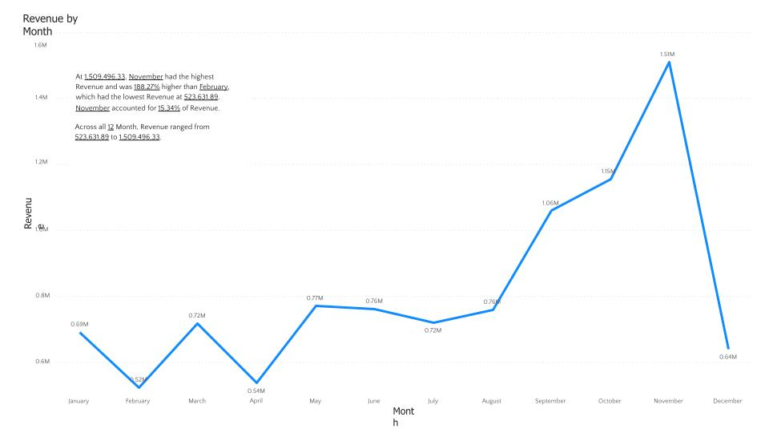
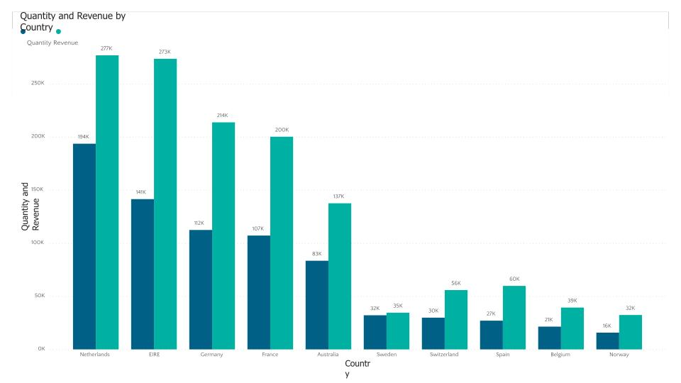
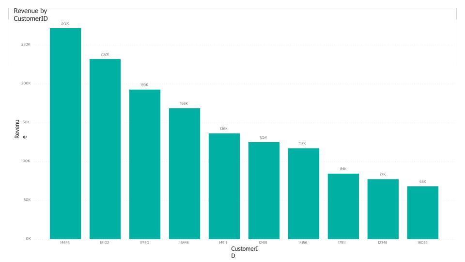
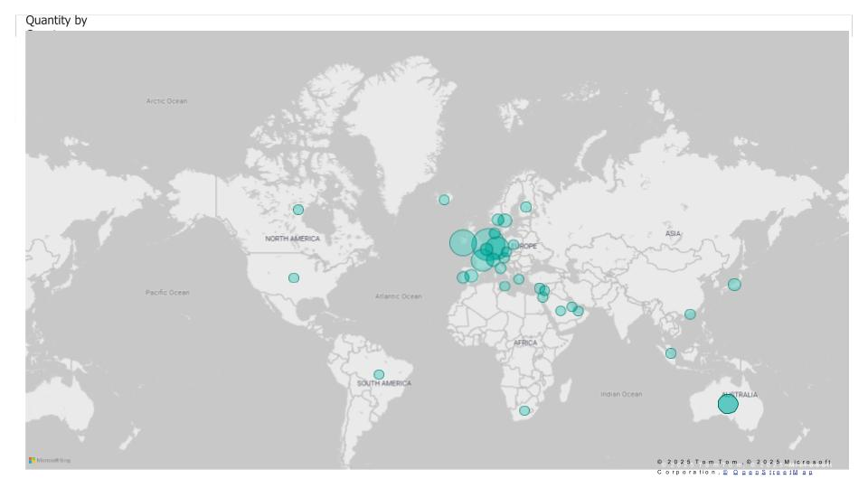

# online_retail_visualization

## Background

An online retail company wanted to to review their data and provide insights that would be valuable to the CEO and CMO of the business. The business has been performing well and the management wants to analyse what the major contributing factors are to the revenue so they can strategically plan for next year. The leadership is interested in viewing the metrics from both an operations and marketing perspective. Management also intends to expand the business and is interested in seeking guidance into areas that are performing well so they can keep a clear focus on what’s working. They would also like to view different metrics based on the demographic information that is available in the data.

## Executive Summary

Sales data reveals strong seasonality, with revenue averaging $685K for the first eight months before surging by 40% in September and peaking at $1.5M in November. Growth opportunities are strongest in the Netherlands, Ireland, Germany, and France, warranting increased market focus.  

- **Seasonality Trend:** Significant revenue increase in the last quarter of the year.  
- **Market Growth:** Strong sales in key European markets, excluding the UK.  
- **Customer Distribution:** Evenly spread purchases, reducing reliance on a few buyers.  
- **Geographic Insights:** Sales concentrated in Europe and Australia, with limited presence in the Americas and none in Africa, Asia, or Russia.  

Expanding into untapped regions and strengthening high-performing markets will be key to maximizing revenue and long-term growth.  

## Insights

### 1. Seasonality Trend

An analysis of store sales data reveals notable seasonal trends. Revenue remains stable for the first eight months, averaging approximately $685K. A significant increase begins in September, with a 40% surge over the previous month. This upward trend continues until November, reaching a peak of $1.5 million, the highest recorded revenue for the year. Due to incomplete data for December, further conclusions cannot be drawn for that period. These findings highlight the seasonal nature of retail sales, with the most substantial growth occurring in the final four months of the year.  

### 2. Market Growth Opportunities  

The analysis of the top 10 countries with potential for growth highlights key markets for expansion. The UK is excluded from this assessment due to its already high demand, with the focus placed on regions where demand can be increased. Findings indicate that the Netherlands, Ireland, Germany, and France generate high sales volumes and revenue. 

### 3. Customer Purchase Distribution  

An analysis of the top 10 customers reveals minimal variation in their purchase volumes. The highest revenue-generating customer purchased only 17% more than the second highest, indicating a well-distributed revenue stream. This suggests that the business is not overly reliant on a small group of customers, reducing the risk of dependency. Additionally, the low disparity in purchases reflects limited customer bargaining power, positioning the business favorably in the market.  

### 4. Geographic Revenue Distribution

The map analysis highlights key revenue-generating regions. Apart from the UK, countries such as the Netherlands, Ireland, Germany, France, and Australia show strong sales performance, making them strategic markets for further investment. The data also reveals that sales are predominantly concentrated in Europe, with limited presence in the Americas. Notably, there is no recorded demand in Africa, Asia, or Russia, indicating potential opportunities for market expansion.  

